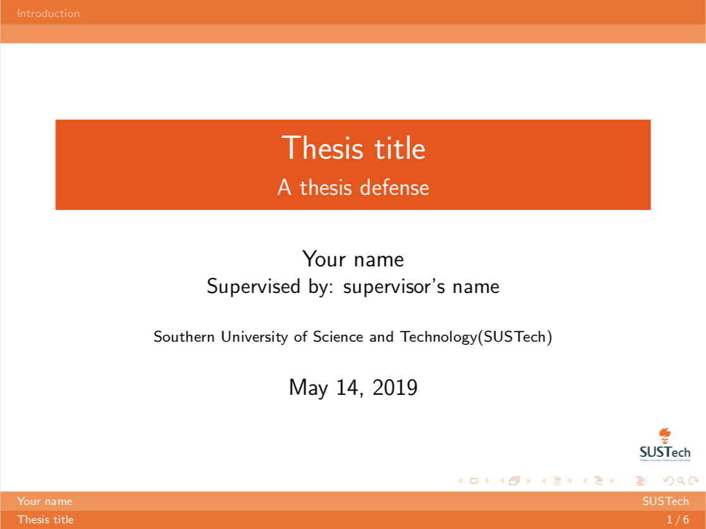
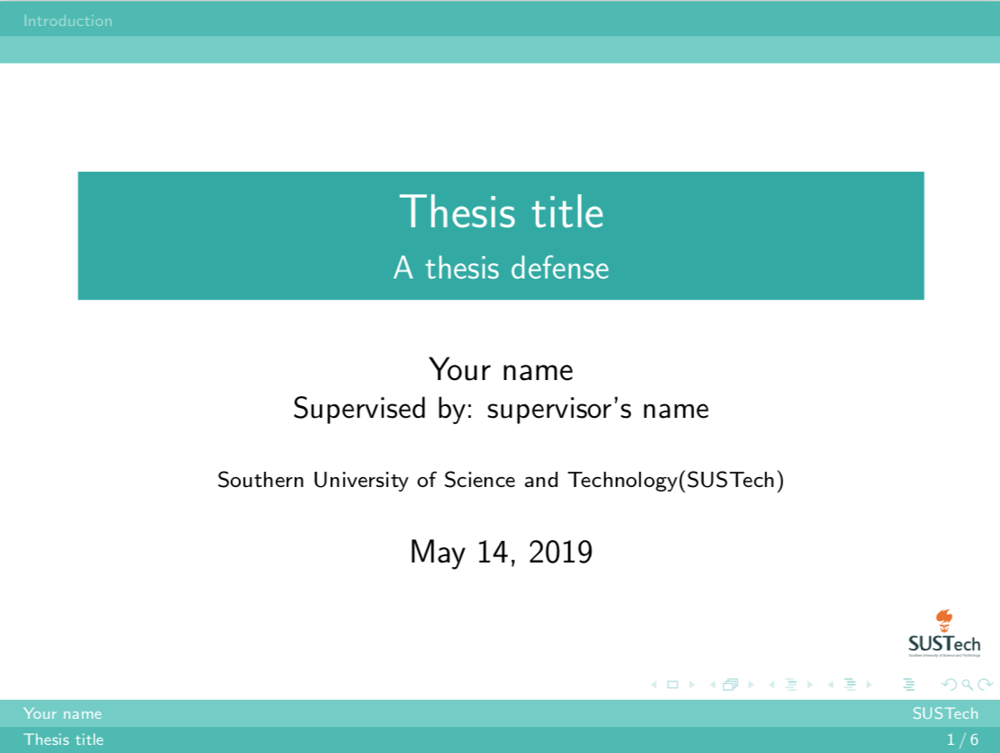

# SUSTech-Defense-Slides

Defense slide template

## Demo

The demo is in [examples](./examples)

- Orange:



- Green:



## Usage

### Color Theme

Change the theme name in `\usecolortheme{}`.

- Orange: `sustechorange`
- Green: `sustechgreen`

### Compile

```bash
make
```

### Citations

Modify the file `references.bib`.

## Author

Yilin Zheng

## Reference

[SUSTech Website](https://www.sustech.edu.cn/zh/school_logo.html)

## License

MIT